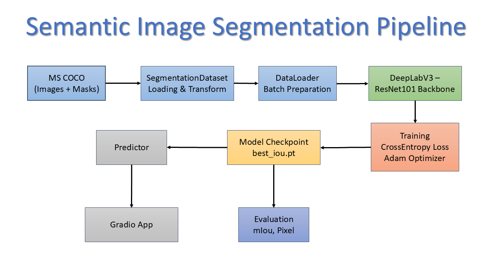
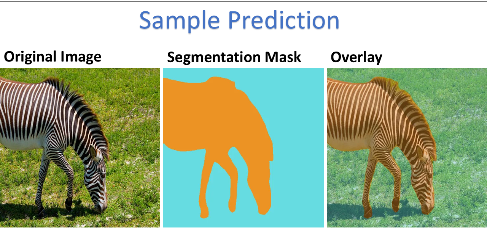

# Semantic Image Segmentation using DeepLabV3-ResNet101


A modular PyTorch implementation of semantic image segmentation using **DeepLabV3-ResNet101**, trained on the **MS COCO** dataset. The project follows a production-oriented repository structure with separate modules for dataset handling, training, evaluation, inference, checkpoint management, model export, and an interactive Gradio application.

The objective of this project is not only to train a high-performing segmentation model, but also to demonstrate clean ML engineering practices by converting an experimental notebook into a maintainable, reusable codebase.

---

## Key Highlights

- DeepLabV3 with ResNet101 backbone
- Semantic segmentation on the MS COCO dataset (81 classes)
- Modular PyTorch project structure
- Automatic checkpoint saving and resume training support
- Comprehensive evaluation using Mean IoU and Pixel Accuracy
- Interactive Gradio application for inference
- TorchScript model export for deployment
- Configuration-driven training pipeline

---

## Project Architecture

<p align="center">
  
</p>

---

## Tech Stack

| Category | Technologies |
|----------|--------------|
| Language | Python |
| Deep Learning | PyTorch, TorchVision |
| Model | DeepLabV3-ResNet101 |
| Dataset | MS COCO |
| Visualization | Matplotlib |
| Web Interface | Gradio |
| Deployment | TorchScript |

---

## Repository Structure

```text
Image-Segmentation/
│
├── assets/
├── configs/
├── checkpoints/
├── models/
├── outputs/
├── src/
│   ├── datasets/
│   ├── evaluation/
│   ├── inference/
│   ├── models/
│   ├── training/
│   └── utils/
│
├── app.py
├── train.py
├── evaluate.py
├── predict.py
├── export.py
├── requirements.txt
└── README.md
```

---

## Dataset

The model is trained using the **MS COCO** semantic segmentation dataset.

Each training sample consists of:

- RGB input image
- Pixel-wise segmentation mask

The dataset pipeline includes:

- Image loading
- Mask loading
- Tensor conversion
- Image normalization
- Efficient batching using PyTorch DataLoader

---

## Model

The project uses **DeepLabV3** with a **ResNet101** backbone.

The final classifier layer is adapted to predict **81 semantic classes** corresponding to the MS COCO label space.

Training configuration:

- Loss Function: CrossEntropyLoss
- Optimizer: Adam
- Learning Rate Scheduler: ReduceLROnPlateau
- Automatic Mixed Precision (CUDA)
- Early Stopping
- Checkpoint Saving

---

## Evaluation

Model performance is evaluated using:

- Mean Intersection over Union (mIoU)
- Pixel Accuracy
- Per-Class IoU

### Final Results

| Metric | Score |
|---------|------:|
| Mean IoU | **0.8184** |
| Pixel Accuracy | **96.6%** |

---

## Sample Prediction

<p align="center">
  
</p>

---

## Features

- Modular project architecture
- Configurable training pipeline
- Automatic checkpoint management
- Resume training from checkpoints
- Evaluation utilities
- Prediction pipeline
- Colorized segmentation masks
- Overlay visualization
- Confidence map generation
- Gradio web interface
- TorchScript export

---

## Installation

Clone the repository

```bash
git clone <repository-url>
cd Image-Segmentation
```

Install dependencies

```bash
pip install -r requirements.txt
```

---

## Usage

Train the model

```bash
python train.py
```

Evaluate the model

```bash
python evaluate.py
```

Run prediction

```bash
python predict.py
```

Launch the Gradio interface

```bash
python app.py
```

Export the model to TorchScript

```bash
python export.py
```

---

## Checkpoints

The trained checkpoint is not included in this repository because of its size.

Place the trained model in:

```text
checkpoints/
└── best_iou.pt
```

Similarly, exported TorchScript models should be stored in:

```text
models/
└── deeplabv3_traced.pt
```

---

## Future Improvements

Possible extensions include:

- Multi-GPU distributed training
- ONNX export
- TensorRT optimization
- Experiment tracking with MLflow or Weights & Biases
- Additional backbone architectures
- Test-time augmentation
- Quantized inference for edge deployment

---

## License

This project is released under the MIT License.